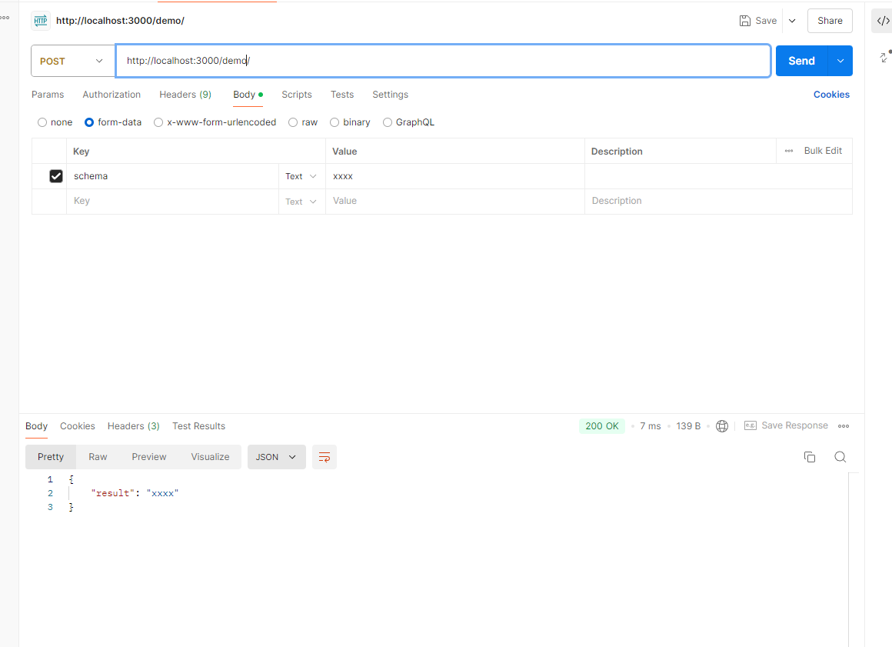
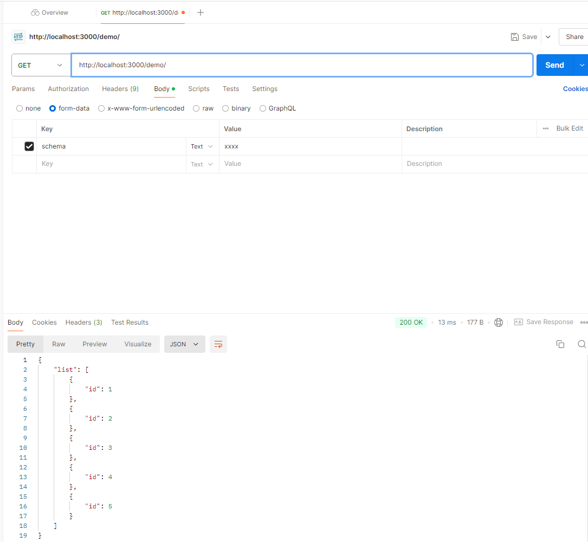

## SimpleMockServer

> 让 mock 更简单

## 使用说明

将需要 Mock 的文件夹放置在 apis 目录下，然后启动服务，其中 api 规则为，目录决定前缀，[api_suffix].[api_method].json,其中，api_suffix 表示 api 路径，api_method,表示拦截的方法，支持 `get|post|patch|head|delete|option|put`，这个只是为了保持结果一致，这里自动拦截了 index.json 为 /。

## 例如

```txt
└─apis
    └─demo
        │  index.get.json -> api为 demo/ get 方法
        │  index.json 会被 index.get.json  覆盖
        │  index.post.json
        │  querybyentity.json -> api为 demo/querybyentity/ get 方法
        │
        └─index
                test.json ->  api为 demo/index/test get 方法
```

## 基本功能

- 返回静态JSON数据
- 根据接口信息返回 
- 根据 Mock 模板生成，见  http://mockjs.com/examples.html

这里支持类似 Vue 的 {{}} 写法，并对，替换后的结果采用 Mockjs 来转换，也就是支持通过 json 生成随机数据。

文件内容为： 
```json
{
  "result": "{{body.schema}}"
}
```



以及 http://mockjs.com/examples.html，

```json
{
    "list|1-10": [
        {
            "id|+1": 1
        }
    ]
}
```
随机生成如下


## 配置文件 .simple-mock
API_DIR=apis // api 目录放在哪儿，必须要有子目录
PORT=3000 // 端口号
LOG_SIZE=10M // 日志记录大小
